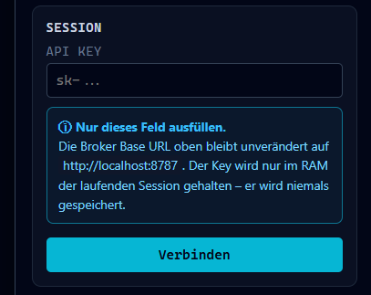

# KI-Anbindung – Konfiguration, Nutzung und Sicherheit

Dieses Dokument beschreibt vollständig, wie der lokale KI-Broker konfiguriert, genutzt und abgesichert wird.

---

## Überblick

Der Simulator enthält ein optionales lokales Backend – den **KI-Broker** – das als sicherer Vermittler zwischen App und KI-Provider dient. Der Simulator selbst läuft vollständig clientseitig und braucht den Broker nicht. Der Broker wird nur benötigt, wenn du die KI-Chat-Funktion im Broker-Modal der App nutzen möchtest.

```
Browser (App)  →  Broker (localhost:8787)  →  KI-Provider (OpenRouter / Anthropic / OpenAI)
```

Der Broker läuft lokal auf deinem Rechner. Dein API-Key verlässt deinen Rechner ausschließlich in Richtung des von dir konfigurierten Providers – niemals in Richtung eines Drittservers.

**Werkstandard:** `PROVIDER=openai-compatible` mit OpenRouter und `minimax/minimax-m2.7` – der Broker ist nach dem Klonen sofort einsatzbereit, du musst nur deinen API-Key im Modal eingeben.

---

## Schnellstart

```bash
# 1. Launcher starten (erstellt .env automatisch, installiert Abhängigkeiten)
node launcher.mjs
# oder unter Windows: Doppelklick auf "Start Launcher.bat"
```

Danach im Simulator-Modal: API-Key eintragen → Verbinden → chatten.

Der Launcher erstellt die `.env` automatisch aus `.env.example` (vorkonfiguriert auf OpenRouter + `minimax/minimax-m2.7`). Du musst nur deinen OpenRouter-API-Key im Modal eingeben.

Alternativ manuell:

```bash
cd validation/api_anbindung/backend-sandbox
cp .env.example .env
# .env ist bereits auf OpenRouter vorkonfiguriert – bei Bedarf anpassen
npm run dev
```

---

## Provider konfigurieren

Alle Einstellungen gehen in `validation/api_anbindung/backend-sandbox/.env` (wird nicht eingecheckt, liegt in `.gitignore`).

> **Wichtig:** Den eigenen API-Key trägst du **nicht** in `.env` ein. Er wird zur Laufzeit im Frontend-Broker-Modal eingegeben und nur im Arbeitsspeicher der laufenden Session gehalten. `.env` steuert nur: welcher Provider-Typ, welche Base-URL, welches Modell.

### OpenRouter (empfohlen, live verifiziert)

OpenRouter ist ein API-Gateway, das Zugang zu Hunderten von Modellen (Anthropic, OpenAI, Meta, Mistral u. v. m.) über eine einzige OpenAI-kompatible Schnittstelle bietet. Empfohlen weil:
- kostenlose Modelle verfügbar (kein Guthaben nötig zum Ausprobieren)
- granulare Key-Beschränkungen im Dashboard (Credit-Limit, Modell-Allowlist, Ablaufzeit)
- live verifiziert mit `minimax/minimax-m2.7`

```ini
# .env (Werkstandard – bereits so in .env.example vorkonfiguriert)
PROVIDER=openai-compatible
PROVIDER_BASE_URL=https://openrouter.ai/api
PROVIDER_DEFAULT_MODEL=minimax/minimax-m2.7
# oder ein anderes Modell, z. B.:
# PROVIDER_DEFAULT_MODEL=anthropic/claude-opus-4-6
# PROVIDER_DEFAULT_MODEL=meta-llama/llama-3.1-8b-instruct:free
```

API-Key erstellen: [openrouter.ai/keys](https://openrouter.ai/keys)
– Empfehlung: Credit-Limit setzen (z. B. 1 $), Key nach Nutzung löschen oder mit Ablaufzeit anlegen.

### Anthropic (direkt)

```ini
# .env
PROVIDER=anthropic
PROVIDER_DEFAULT_MODEL=claude-opus-4-6
```

API-Key erstellen: [console.anthropic.com/settings/keys](https://console.anthropic.com/settings/keys)

### OpenAI (direkt)

```ini
# .env
PROVIDER=openai-compatible
PROVIDER_BASE_URL=https://api.openai.com
PROVIDER_DEFAULT_MODEL=gpt-4o
```

API-Key erstellen: [platform.openai.com/api-keys](https://platform.openai.com/api-keys)

### Ollama (lokal, kein API-Key nötig)

Ollama läuft vollständig lokal auf deinem Rechner – kein externer API-Call, kein Account nötig.

```ini
# .env
PROVIDER=openai-compatible
PROVIDER_BASE_URL=http://localhost:11434
PROVIDER_DEFAULT_MODEL=llama3.2
```

Voraussetzung: [ollama.ai](https://ollama.ai) installiert und `ollama pull llama3.2` ausgeführt.

### Alle Provider-Optionen im Überblick

| `PROVIDER` | `PROVIDER_BASE_URL` | Einsatz |
|---|---|---|
| `noop` | – | Entwicklung / Testen ohne echten Call |
| `anthropic` | – | Direkte Anthropic API |
| `openai-compatible` | `https://openrouter.ai/api` | OpenRouter (empfohlen) |
| `openai-compatible` | `https://api.openai.com` | OpenAI direkt |
| `openai-compatible` | `http://localhost:11434` | Ollama lokal |
| `openai-compatible` | Beliebige URL | Jede OpenAI-kompatible API |

Weitere Einstellungen in `.env`:

```ini
PROVIDER_TIMEOUT_MS=30000    # Timeout pro Request in ms (Standard: 30 s)
PROVIDER_MAX_ATTEMPTS=2      # Retry-Versuche bei transienten Fehlern
SESSION_TTL_SECONDS=900      # Session-Gültigkeit in Sekunden (Standard: 15 Min)
```

---

## Die KI-Funktion im Simulator nutzen

1. Broker starten (`npm run dev` im Broker-Ordner, oder per Launcher)
2. Im Simulator oben rechts auf das **Broker-Modal** klicken (Wolken-/KI-Icon)
3. **Nur das API-Key-Feld ausfüllen** – die Broker Base URL (`http://localhost:8787`) bleibt unverändert
4. Auf **Verbinden** klicken
5. Mit der KI über die aktuell geöffnete Schaltung chatten
6. Nach der Nutzung: **Trennen** oder **Key löschen** – der Key wird aus dem Arbeitsspeicher entfernt



> **Hinweis:** Die Broker Base URL ist während einer aktiven Sitzung gesperrt, damit Session und Broker-Endpunkt nicht auseinanderlaufen. Sie muss nicht geändert werden.

Der Broker kennt immer nur die **aktuell geöffnete Schaltung**. Er hat keinen Zugriff auf andere Projekte, das Dateisystem oder andere App-Zustände.

---

## Sicherheits-Best-Practices

### 1. Codebase vor der Nutzung sichten

Bevor du einen echten API-Key einträgst, solltest du prüfen, was der Broker mit dem Key macht. Die relevanten Dateien mit direkten Verweisen:

| Datei | Was sie macht |
|---|---|
| `validation/api_anbindung/backend-sandbox/.env.example` | Vollständige Konfigurationsreferenz |
| `validation/api_anbindung/backend-sandbox/src/shared/config.ts` | Konfigurationsschema mit Validierung (Zod) |
| `validation/api_anbindung/backend-sandbox/src/modules/auth/session-service.ts` | Key-Registrierung und Session-Lebenszyklus |
| `validation/api_anbindung/backend-sandbox/src/modules/auth/key-reference-store.ts` | Wie der Key intern referenziert wird (nie als Klartext in Logs) |
| `validation/api_anbindung/backend-sandbox/src/modules/provider-gateway/anthropic-provider-client.ts` | Direkter Anthropic-API-Call (native fetch, kein SDK) |
| `validation/api_anbindung/backend-sandbox/src/modules/provider-gateway/openai-compatible-provider-client.ts` | OpenAI-kompatibler API-Call |
| `validation/api_anbindung/backend-sandbox/src/modules/audit-and-observability/redaction.ts` | Log-Redaktion – stellt sicher, dass der Key nicht in Logs auftaucht |
| `validation/api_anbindung/backend-sandbox/src/contracts/chat.ts` | Chat-Request-Schema mit `.strict()` – nur erlaubte Felder |
| `validation/api_anbindung/backend-sandbox/src/modules/policy-guardrails/policy-engine.ts` | Policy-Prüfung vor jedem Provider-Call |

### 2. API-Keys mit kurzer Gültigkeitsdauer erzeugen

Verwende **niemals einen unbefristeten Produktions-Key** für den Broker. Best Practice:

- **Für kurze Nutzungssessions:** Key mit 1-Stunden-Ablauf erstellen, danach löschen
- **Bei OpenRouter:** Im Dashboard unter `Keys` → `Create Key` → `Limit` auf gewünschten Betrag setzen (z. B. 0,50 $) + Ablaufdatum
- **Bei Anthropic:** Workspaces nutzen, Key nach Nutzung im Console-Dashboard widerrufen
- **Bei OpenAI:** Key mit Usage-Limit anlegen (`platform.openai.com/api-keys` → `Edit permissions`)
- **Faustregel:** Key so kurz leben lassen wie die Nutzungsdauer – wer 30 Minuten chattet, braucht keinen Key der eine Woche gültig ist

### 3. Was der Broker mit dem Key macht

- Der Key wird **ausschließlich im Arbeitsspeicher** der laufenden Session gehalten (`session-service.ts`)
- Er wird **niemals in Logs, Fehlermeldungen oder API-Antworten** zurückgegeben (erzwungen durch `redaction.ts`)
- Er wird **nicht** in `.env`, in einer Datei oder einer Datenbank gespeichert
- Er verlässt deinen Rechner **ausschließlich** in einem `Authorization`-Header Richtung Provider (SSRF-Schutz: Zielhostname wird gegen eine Allowlist geprüft, bevor der Key abgerufen wird)
- Beim **Trennen oder Key löschen** wird die Session sofort invalidiert und der Key aus dem Arbeitsspeicher entfernt

### 4. Gehärtete Sicherheitsmaßnahmen (H1–H5)

Der Broker implementiert fünf Härtungsmaßnahmen, die live verifiziert sind (`smoke-verify.mjs`):

| ID | Maßnahme | Detail |
|---|---|---|
| H1 | **Prompt-Größenlimit** | Requests > 32 KB werden mit HTTP 400 `PROMPT_TOO_LARGE` abgelehnt – verhindert Token-Flooding |
| H2 | **Model-Lock** | Das Modell wird serverseitig aus `.env` bezogen. Das Frontend kann das Modell nicht überschreiben (Zod `.strict()` auf dem Request-Schema) |
| H3 | **History-Limit** | Conversation-History ist auf 32 Turns (gleitendes Fenster) begrenzt – älteste Turns werden gedroppt |
| H4 | **SSRF-Schutz** | Beide Provider-Clients prüfen den Ziel-Hostnamen gegen eine `allowedHosts`-Liste **vor** jedem Netzwerkzugriff und **vor** dem Key-Abruf |
| H5 | **dispatchMode** | `live` / `mock` / `noop` sind klar unterschieden – kein stiller Fallback auf unbekannte Modi |

### 5. Kein zentraler Server

Der Broker ist Self-Hosted: er läuft auf `127.0.0.1:8787` – ausschließlich auf deinem Rechner. Es gibt keinen zentralen Cloud-Server der Anfragen, Keys oder Schaltungsdaten empfängt. Jeder Nutzer betreibt seinen eigenen Broker mit seinem eigenen Key.

---

## Weitere Dokumentation

| Dokument | Inhalt |
|---|---|
| `validation/api_anbindung/README.md` | Aktueller Integrationsstand (API1-01 bis API2-BF) |
| `validation/api_anbindung/backend-sandbox/.env.example` | Vollständige Konfigurationsreferenz |
| `validation/api_anbindung/backend-sandbox/smoke-verify.mjs` | Live-Verifikation der Härtungsmaßnahmen H1–H5 |

---

---

# AI Integration – Configuration, Usage and Security

This document fully describes how to configure, use and secure the local AI broker.

---

## Overview

The simulator includes an optional local backend – the **AI Broker** – which acts as a secure intermediary between the app and the AI provider. The simulator itself runs entirely client-side and does not require the broker. The broker is only needed if you want to use the AI chat feature via the broker modal in the app.

```
Browser (App)  →  Broker (localhost:8787)  →  AI Provider (OpenRouter / Anthropic / OpenAI)
```

The broker runs locally on your machine. Your API key leaves your machine exclusively towards the provider you configured – never towards a third-party server.

**Default:** `PROVIDER=openai-compatible` with OpenRouter and `minimax/minimax-m2.7` – the broker is ready to use after cloning, you only need to enter your API key in the modal.

---

## Quick Start

```bash
# 1. Start the launcher (creates .env automatically, installs dependencies)
node launcher.mjs
# or on Windows: double-click "Start Launcher.bat"
```

Then in the simulator modal: enter your API key → Connect → chat.

The launcher creates `.env` automatically from `.env.example` (preconfigured for OpenRouter + `minimax/minimax-m2.7`). You only need to enter your OpenRouter API key in the modal.

Alternatively, manually:

```bash
cd validation/api_anbindung/backend-sandbox
cp .env.example .env
# .env is already preconfigured for OpenRouter – adjust if needed
npm run dev
```

---

## Configuring a Provider

All settings go into `validation/api_anbindung/backend-sandbox/.env` (not checked in, listed in `.gitignore`).

> **Important:** Do **not** put your API key in `.env`. It is entered at runtime in the frontend broker modal and held only in the memory of the running session. `.env` controls only: which provider type, which base URL, which model.

### OpenRouter (recommended, live verified)

OpenRouter is an API gateway giving access to hundreds of models (Anthropic, OpenAI, Meta, Mistral, and more) through a single OpenAI-compatible interface. Recommended because:
- Free models available (no credit needed to try it out)
- Granular key restrictions in the dashboard (credit limit, model allowlist, expiry)
- Live verified with `minimax/minimax-m2.7`

```ini
# .env (default – already preconfigured in .env.example)
PROVIDER=openai-compatible
PROVIDER_BASE_URL=https://openrouter.ai/api
PROVIDER_DEFAULT_MODEL=minimax/minimax-m2.7
# or another model, e.g.:
# PROVIDER_DEFAULT_MODEL=anthropic/claude-opus-4-6
# PROVIDER_DEFAULT_MODEL=meta-llama/llama-3.1-8b-instruct:free
```

Create an API key: [openrouter.ai/keys](https://openrouter.ai/keys)
– Recommendation: set a credit limit (e.g. $1), delete the key after use or create it with an expiry date.

### Anthropic (direct)

```ini
# .env
PROVIDER=anthropic
PROVIDER_DEFAULT_MODEL=claude-opus-4-6
```

Create an API key: [console.anthropic.com/settings/keys](https://console.anthropic.com/settings/keys)

### OpenAI (direct)

```ini
# .env
PROVIDER=openai-compatible
PROVIDER_BASE_URL=https://api.openai.com
PROVIDER_DEFAULT_MODEL=gpt-4o
```

Create an API key: [platform.openai.com/api-keys](https://platform.openai.com/api-keys)

### Ollama (local, no API key needed)

Ollama runs entirely on your machine – no external API call, no account required.

```ini
# .env
PROVIDER=openai-compatible
PROVIDER_BASE_URL=http://localhost:11434
PROVIDER_DEFAULT_MODEL=llama3.2
```

Prerequisite: [ollama.ai](https://ollama.ai) installed and `ollama pull llama3.2` executed.

### All Provider Options at a Glance

| `PROVIDER` | `PROVIDER_BASE_URL` | Use case |
|---|---|---|
| `noop` | – | Development / testing without real API calls |
| `anthropic` | – | Direct Anthropic API |
| `openai-compatible` | `https://openrouter.ai/api` | OpenRouter (recommended) |
| `openai-compatible` | `https://api.openai.com` | OpenAI direct |
| `openai-compatible` | `http://localhost:11434` | Ollama local |
| `openai-compatible` | Any URL | Any OpenAI-compatible API |

Additional settings in `.env`:

```ini
PROVIDER_TIMEOUT_MS=30000    # Timeout per request in ms (default: 30 s)
PROVIDER_MAX_ATTEMPTS=2      # Retry attempts for transient errors
SESSION_TTL_SECONDS=900      # Session validity in seconds (default: 15 min)
```

---

## Using the AI Feature in the Simulator

1. Start the broker (`npm run dev` in the broker directory, or via the launcher)
2. Click the **Broker Modal** in the top-right of the simulator (cloud/AI icon)
3. **Only fill in the API Key field** – the Broker Base URL (`http://localhost:8787`) stays unchanged
4. Click **Connect**
5. Chat with the AI about the currently open circuit
6. After use: **Disconnect** or **Delete Key** – the key is removed from memory


> **Note:** The Broker Base URL is locked during an active session to prevent the session and broker endpoint from diverging. It does not need to be changed.

The broker only ever knows the **currently open circuit**. It has no access to other projects, the file system, or other app state.

---

## Security Best Practices

### 1. Review the Codebase Before Use

Before entering a real API key, you should verify what the broker does with it. Relevant files with direct references:

| File | What it does |
|---|---|
| `validation/api_anbindung/backend-sandbox/.env.example` | Full configuration reference |
| `validation/api_anbindung/backend-sandbox/src/shared/config.ts` | Configuration schema with validation (Zod) |
| `validation/api_anbindung/backend-sandbox/src/modules/auth/session-service.ts` | Key registration and session lifecycle |
| `validation/api_anbindung/backend-sandbox/src/modules/auth/key-reference-store.ts` | How the key is referenced internally (never as plaintext in logs) |
| `validation/api_anbindung/backend-sandbox/src/modules/provider-gateway/anthropic-provider-client.ts` | Direct Anthropic API call (native fetch, no SDK) |
| `validation/api_anbindung/backend-sandbox/src/modules/provider-gateway/openai-compatible-provider-client.ts` | OpenAI-compatible API call |
| `validation/api_anbindung/backend-sandbox/src/modules/audit-and-observability/redaction.ts` | Log redaction – ensures the key never appears in logs |
| `validation/api_anbindung/backend-sandbox/src/contracts/chat.ts` | Chat request schema with `.strict()` – only allowed fields |
| `validation/api_anbindung/backend-sandbox/src/modules/policy-guardrails/policy-engine.ts` | Policy check before every provider call |

### 2. Create API Keys with Short Expiry

**Never use an indefinite production key** for the broker. Best practice:

- **For short usage sessions:** Create a key with a 1-hour expiry, then delete it
- **With OpenRouter:** In the dashboard under `Keys` → `Create Key` → set `Limit` to desired amount (e.g. $0.50) + expiry date
- **With Anthropic:** Use workspaces, revoke the key via the console dashboard after use
- **With OpenAI:** Create a key with a usage limit (`platform.openai.com/api-keys` → `Edit permissions`)
- **Rule of thumb:** Let the key live as long as the usage session – someone chatting for 30 minutes does not need a key valid for a week

### 3. What the Broker Does with Your Key

- The key is held **exclusively in memory** of the running session (`session-service.ts`)
- It is **never returned** in logs, error messages or API responses (enforced by `redaction.ts`)
- It is **not** stored in `.env`, a file, or a database
- It leaves your machine **exclusively** in an `Authorization` header towards the provider (SSRF protection: the target hostname is checked against an allowlist before the key is retrieved)
- Upon **Disconnect or Delete Key** the session is immediately invalidated and the key is removed from memory

### 4. Hardened Security Measures (H1–H5)

The broker implements five hardening measures, all live verified (`smoke-verify.mjs`):

| ID | Measure | Detail |
|---|---|---|
| H1 | **Prompt size limit** | Requests > 32 KB are rejected with HTTP 400 `PROMPT_TOO_LARGE` – prevents token flooding |
| H2 | **Model lock** | The model is sourced server-side from `.env`. The frontend cannot override the model (Zod `.strict()` on the request schema) |
| H3 | **History limit** | Conversation history is capped at 32 turns (sliding window) – oldest turns are dropped |
| H4 | **SSRF protection** | Both provider clients check the target hostname against an `allowedHosts` list **before** any network access and **before** retrieving the key |
| H5 | **dispatchMode** | `live` / `mock` / `noop` are clearly distinguished – no silent fallback to unknown modes |

### 5. No Central Server

The broker is self-hosted: it runs on `127.0.0.1:8787` – exclusively on your machine. There is no central cloud server receiving requests, keys or circuit data. Every user runs their own broker with their own key.

---

## Further Documentation

| Document | Content |
|---|---|
| `validation/api_anbindung/README.md` | Current integration status (API1-01 through API2-BF) |
| `validation/api_anbindung/backend-sandbox/.env.example` | Full configuration reference |
| `validation/api_anbindung/backend-sandbox/smoke-verify.mjs` | Live verification of hardening measures H1–H5 |
