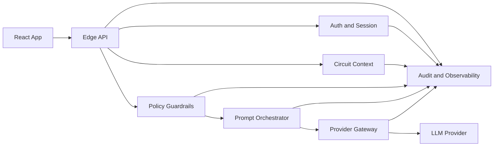

# System Overview

## Zielbild

Das Backend ist ein kleiner, abgesicherter Vermittlungsdienst zwischen der Browser-App und einem oder mehreren KI-Providern. Die App bleibt weiter fuer die Bearbeitung der Schaltung zustaendig. Das Backend ist nur fuer sichere Chat-Kommunikation ueber die aktuell geoeffnete Schaltung da.

## Komponenten

- Frontend-App
  - sammelt den Zustand der aktuell geoeffneten Schaltung
  - zeigt Chat-UI, Fehlermeldungen und Status an
  - sendet keine Provider-Requests direkt
- Edge API
  - validiert Requests am Eingang
  - normalisiert Antworten und Fehler
  - erzwingt Request-Grenzen
- Auth und Session-Layer
  - bindet Anfragen an eine Backend-Session
  - ordnet Benutzer-Key, Limits und Chat-Status kontrolliert zu
- Circuit Context Service
  - prueft, reduziert und serialisiert den Schaltungskontext
  - entfernt unnoetige oder zu grosse Felder
- Policy and Guardrails
  - validiert erlaubte Aufgaben
  - verhindert unerwuenschte Prompts, uebergrosse Eingaben und verbotene Parameter
- Prompt Orchestrator
  - baut System- und User-Prompt aus validiertem Kontext
  - kuerzt oder fasst Daten kontrolliert zusammen
- Provider Gateway
  - einzige Schicht mit Netzwerkausleitung zu KI-Providern
  - verwaltet Timeouts, Retries und Provider-Mapping
- Audit and Observability
  - erzeugt redigierte Logs, Metriken und Sicherheitsereignisse

## Referenzarchitektur

## Harte Architekturregeln

- kein direkter Provider-Aufruf aus dem Browser
- kein dauerhafter Projektkatalog im Backend
- kein unvalidiertes Durchreichen von Frontend-Payloads
- keine Speicherung von Secrets im Klartext-Log
- keine Provider-spezifische Speziallogik im Frontend

## Spaetere Implementierungsschritte

1. Laufzeitstack waehlen, zum Beispiel TypeScript mit Fastify oder Express
2. zentrale Schema-Validierung am Edge einfuehren
3. Session- und Secret-Schutz mit verschluesselter Speicherung oder Kurzzeit-Token aufbauen
4. Provider Gateway physisch von UI-naher Logik trennen
5. Observability und Security Events von Anfang an einbauen
